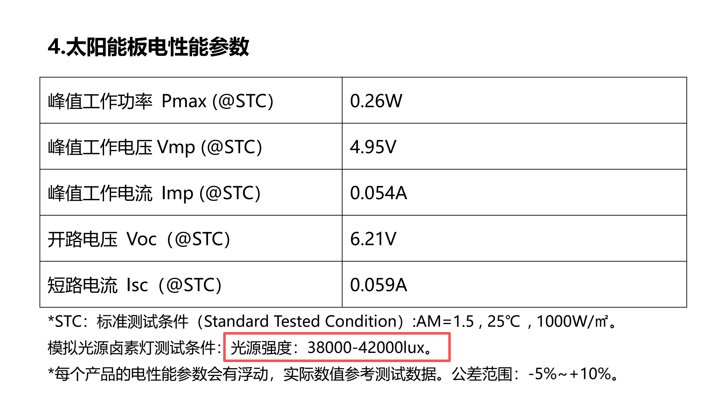
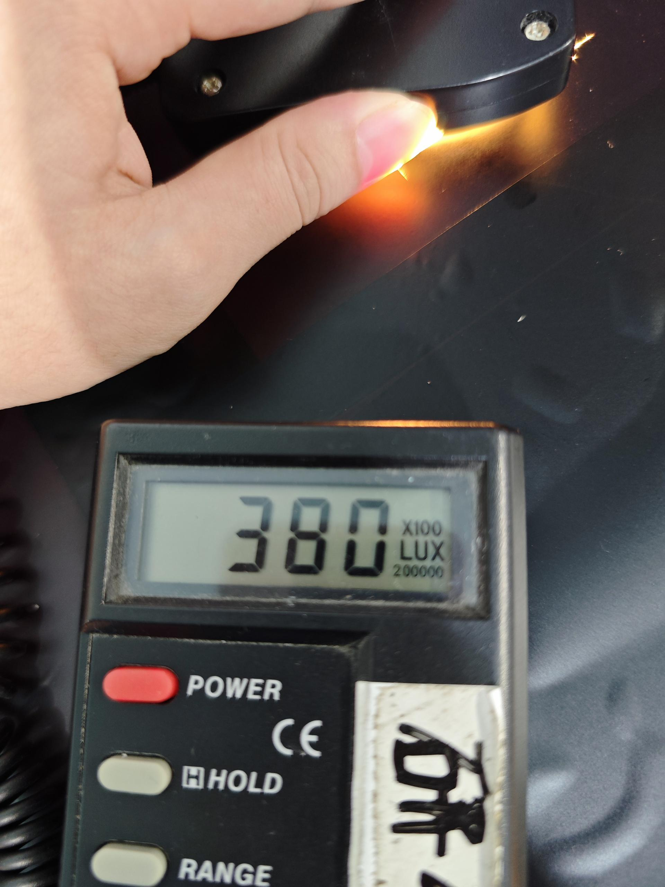
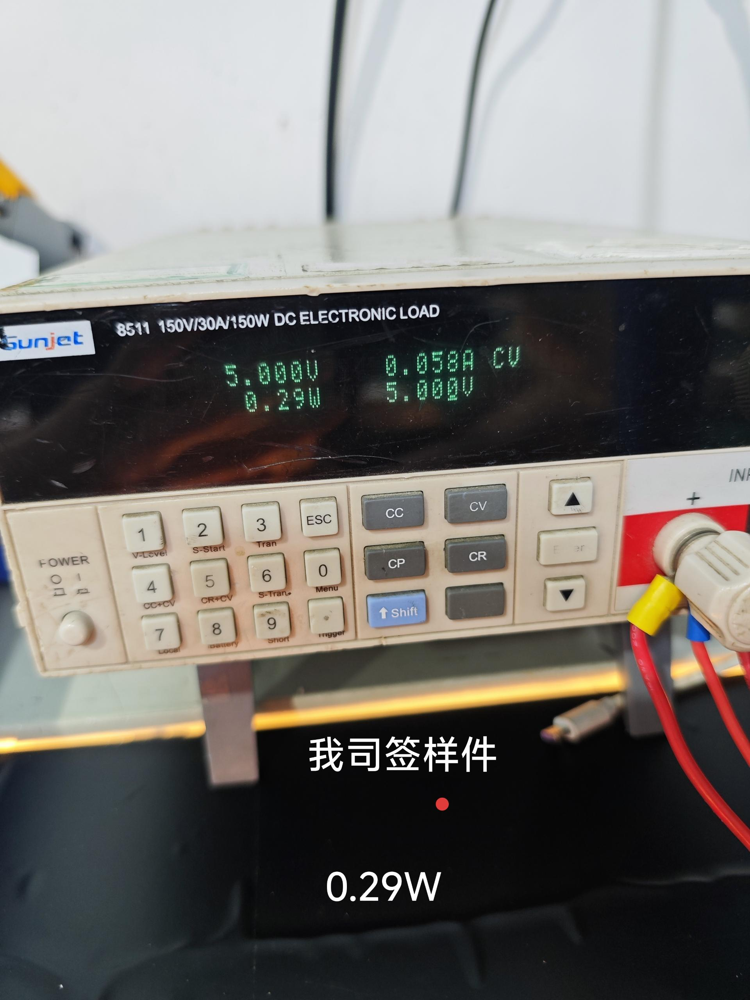
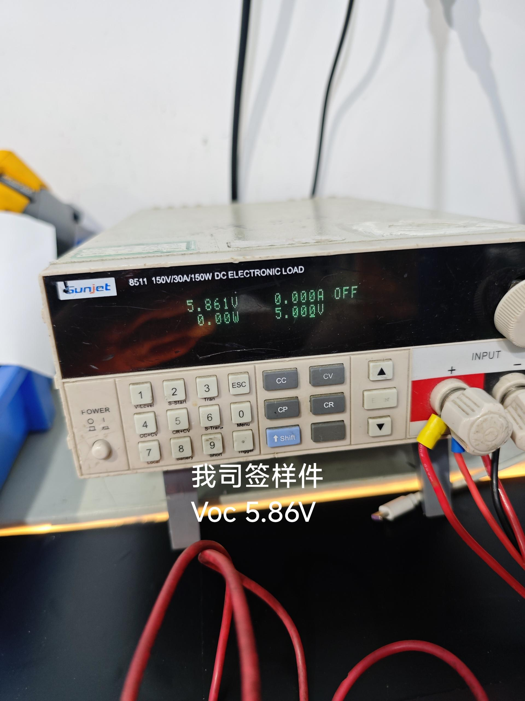
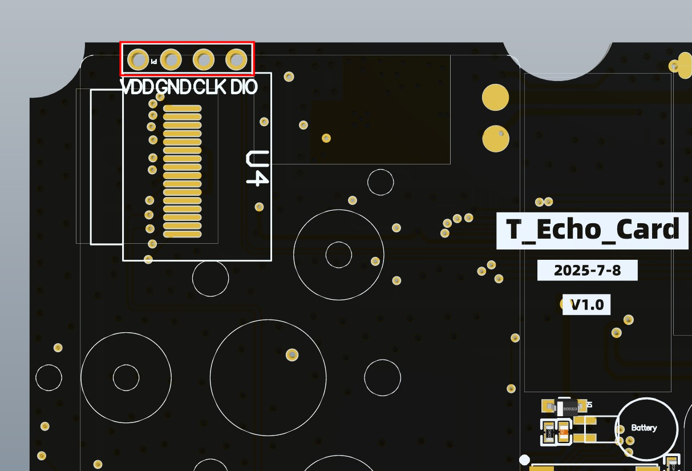
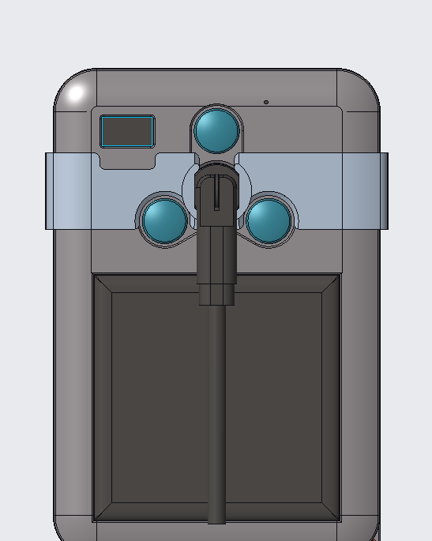

<!--
 * @Description: None
 * @Author: LILYGO_L
 * @Date: 2025-10-11 13:45:15
 * @LastEditTime: 2026-07-02 11:18:39
 * @License: GPL 3.0
-->

<h1 align = "center">T-Echo-Card</h1>

    

## **[English](./README.md) | 中文**

## 版本迭代:
| Version                               | Update date                       |
| :-------------------------------: | :-------------------------------: |
| T-Echo-Card_V1.0            | 2025-10-11                         |

## 购买链接
| Product                     | SOC           |  FLASH  |  RAM   | Link                   |
| :------------------------: | :-----------: |:-------: | :---------: | :------------------: |
| T-Echo-Card_V1.0   | nRF52840 |   1M   |256kB| NULL |

## 目录
- [描述](#描述)
- [预览](#预览)
- [模块](#模块)
- [软件部署](#软件部署)
- [引脚总览](#引脚总览)
- [相关测试](#相关测试)
- [常见问题](#常见问题)
- [项目](#项目)

## 描述

T-Echo-Card是基于nRF52840芯片开发的低功耗板子，拥有太阳能充电板可持续为设备供电，板载丰富的功能，惯性传感器、扬声器麦克风模块、GPS等功能。

## 预览

### 实物图

<!-- 

    

---

    

---

    

 -->

## 模块

### 1. MCU

* 芯片：nRF52840
* RAM：256kB
* FLASH：1M
* 相关资料：
    >[nRF52840_Datasheet](https://docs.nordicsemi.com/bundle/ps_nrf52840/page/keyfeatures_html5.html)

### 2. 屏幕

* 分辨率：72x40px
* 屏幕类型：OLED
* 驱动芯片：SSD1315
* 总线通信协议：IIC
* 依赖库：
    >[Adafruit_BusIO](https://github.com/adafruit/Adafruit_BusIO)  
    >[Adafruit-GFX-Library](https://github.com/adafruit/Adafruit-GFX-Library)

### S62F LoRa 硬件配置

* 模组：S62F（SX1262）
* 射频开关：T-Echo-Card 使用 AcSiP 控制模式 A，由 nRF52840 直接控制 `RF_VC1`（`P0.27`）和 `RF_VC2`（`P1.01`）。`DIO2`（`P0.05`）是单独引出的信号，不能替代这两个控制引脚。发射时设置 `RF_VC1/RF_VC2` 为 `HIGH/LOW`，接收时设置为 `LOW/HIGH`。
* TCXO：内置 32 MHz TCXO 由 SX1262 的 `DIO3` 内部控制。初始化射频模块时，应将 `tcxoVoltage` 明确设置为 `3.0 V`。
* 稳压器：`VREG` 与 `DCC_SW` 通过 15 uH 电感连接，应使用 DC-DC 稳压模式（`useRegulatorLDO = false`）。
* 相关资料：
    >[S62F](./information/S62F.pdf)
    >[S62F 应用说明](./information/S62F_ApplicationNote_Ver_D.pdf)

### 3. GPS

* 芯片：L76K
* 总线通信协议：UART
* 依赖库：
    > [cpp_bus_driver](https://github.com/Llgok/cpp_bus_driver)
* 相关资料：
    >[L76K](./information/L76KB-A58.pdf)

### 4. 惯性传感器

* 模块：ICM20948
* 总线通信协议：IIC
* 依赖库：
    >[ICM20948_WE](https://github.com/wollewald/ICM20948_WE)   
* 相关资料：
    >[ICM20948](./information/ICM20948.pdf)

### 5. Flash

* 兼容芯片：ZD25WQ32C（`BA 60 16`）和 ZD25Q32D（`BA 40 16`）
* 总线通信协议：SPI
* 依赖库：
    >[Adafruit_BusIO](https://github.com/adafruit/Adafruit_BusIO)  
    >[Adafruit_SPIFlash](https://github.com/adafruit/Adafruit_SPIFlash)  
* 相关资料：
    >[ZD25WQ32CEIGR](./information/ZD25WQ32CEIGR.pdf)

### 6. LED

* 芯片：WS2812
* 依赖库：
    > [Adafruit_NeoPixel](https://github.com/adafruit/Adafruit_NeoPixel)
* 相关资料：
    >[WS2812](./information/WS2812C-2020.pdf)

### 7. 扬声器

* 驱动芯片：MAX98357
* 总线通信协议：IIS
* 依赖库：
    > [cpp_bus_driver](https://github.com/Llgok/cpp_bus_driver)
* 相关资料：
    >[MAX98357](./information/MAX98357AETE+T.pdf)

### 8. 麦克风

* 驱动芯片：MP34DT05
* 总线通信协议：PDM
* 依赖库：
    > [cpp_bus_driver](https://github.com/Llgok/cpp_bus_driver)
* 相关资料：
    >[MP34DT05](./information/mp34dt05-a.pdf)

### 9. 太阳能板

* 标准测试条件（STC）下的电气参数：

| 参数 | 数值 |
| --- | --- |
| 峰值工作功率 Pmax | 0.26 W |
| 峰值工作电压 Vmp | 4.95 V |
| 峰值工作电流 Imp | 0.054 A |
| 开路电压 Voc | 6.21 V |
| 短路电流 Isc | 0.059 A |

* 模拟光源测试条件：光照强度约为 38000～42000 lux。
* 样品测试结果：在约 38000 lux 光照强度下，开路电压约为 5.86 V；使用电子负载进行恒压测试时，输出约为 5.00 V、0.058 A、0.29 W。
* 不同产品的电性能参数可能存在浮动，实际数值以测试结果为准，公差范围为 -5%～+10%。

  

  
  
  

## 软件部署

### 示例支持

| Example | `[Arduino IDE (Adafruit_nRF52_V1.6.1)]`   `[PlatformIO (nordicnrf52_V10.6.0)]`   Support | Description | Picture |
| ------  | ------  | ------ | ------ | 
| [buzzer](./examples/buzzer) | 
![alt text][supported]  |  |  |
| [Display](./examples/Display) | 
![alt text][supported]  |  |  |
| [Flash](./examples/Flash) | 
![alt text][supported]  |  |  |
| [Flash_Erase](./examples/Flash_Erase) | 
![alt text][supported]  |  |  |
| [Flash_Speed_Test](./examples/Flash_Speed_Test) | 
![alt text][supported]  |  |  |
| [gps](./examples/GPS) | 
![alt text][supported]  |  |  |
| [IIC_Scan_2](./examples/IIC_Scan_2) | 
![alt text][supported]  |  |  |
| [nfc_text_record](./examples/nfc_text_record) | 
![alt text][supported]  | NFC-A Type 2 Tag NDEF 文本记录 |  |
| [original_test](./examples/original_test) |
![alt text][supported]  | 出厂测试程序 |  |
| [pdm](./examples/pdm) | 
![alt text][supported]  |  |  |
| [play_music](./examples/play_music) | 
![alt text][supported]  |  |  |
| [qmc5883p](./examples/qmc5883p) | 
![alt text][supported]  |  |  |
| [voice_speaker](./examples/voice_speaker) | 
![alt text][supported]  |  |  |
| [ws2812](./examples/ws2812) | 
![alt text][supported]  |  |  |

[supported]: https://img.shields.io/badge/-supported-green "example"

| Bootloader | Description | Picture |
| ------  | ------  | ------ |
| [T-Echo-Card bootloader](<./bootloader/T-Echo-Card bootloader/>) | T-Echo-Card 出厂引导程序示例，已启用 NFC 引脚功能 |  |
| [nfc_uicr_repair](./bootloader/nfc_uicr_repair/) | 用于清除旧配置并将 UICR NFCPINS 恢复为 NFC 天线功能的修复固件 |  |

| Firmware | Description | Picture |
| ------  | ------  | ------ |
| [original_test](./firmware/[T-Echo-Card_V1.0][original_test]_firmware/)| 出厂测试程序 |  |

#### NFC固件烧录顺序

使用 NFC 功能前，请先运行主板中的 `original_test` 出厂固件并进入 NFC 测试界面，根据测试结果选择对应的处理方式。

##### NFC 测试正常的主板

如果 NFC 测试界面能够正常启动，且手机能够读取 NFC 内容，说明主板已经使用支持 NFC 的新版 Bootloader。此类主板不需要更新 Bootloader，也不需要运行 `nfc_uicr_repair`；如需更新应用程序，可直接烧录目标应用固件。

##### NFC 测试报错的主板

出厂固件的 NFC 测试界面报错时，按照旧版 Bootloader 主板处理：

1. 连续按下两次 RST 复位按键进入 UF2 模式。
2. 将 [T-Echo-Card bootloader](<./bootloader/T-Echo-Card bootloader/>) 目录中以 `update-` 开头的最新 Bootloader `.uf2` 文件复制到 UF2 磁盘，用支持 NFC 的新版 Bootloader 覆盖旧版本。
3. 等待复制完成及设备自动重启，然后重新进入 UF2 模式。
4. 烧录 [nfc_uicr_repair](./bootloader/nfc_uicr_repair/) 目录中的修复固件，清除旧版 Bootloader 留下的 UICR NFC 引脚配置，并将 NFCPINS 恢复为 NFC 天线功能。
5. 等待修复程序运行完成，然后重新进入 UF2 模式。
6. 烧录需要运行的应用层固件，例如 [nfc_text_record](./examples/nfc_text_record/) 示例。

##### 全新空片或没有任何程序的主板

1. 连接 J-Link/SWD 调试器。
2. 使用 J-Link/SWD 烧录 [T-Echo-Card bootloader](<./bootloader/T-Echo-Card bootloader/>) 目录中的最新 Bootloader `.hex` 文件。
3. 复位主板并确认能够正常进入 UF2 模式。
4. 直接烧录需要运行的应用层固件。全新空片没有旧版 Bootloader 遗留的 UICR 配置，因此不需要运行 `nfc_uicr_repair`。

> [!WARNING]
> 烧录和运行 `nfc_uicr_repair` 期间必须保持稳定供电，严禁断电、复位、拔出 USB 或中断烧录。该程序会擦除并重写 UICR；如果操作过程中意外断电，可能导致 UICR 中与 Bootloader 相关的配置不完整，造成 Bootloader 无法启动或引导区异常。发生此问题时，可能需要使用 J-Link/SWD 重新擦除并烧录 Bootloader 才能恢复设备。

> [!IMPORTANT]
> `nfc_uicr_repair` 仅用于 NFC 测试报错且已经更新新版 Bootloader 的旧主板，不是最终应用程序。NFC 测试正常的主板和全新空片均不得执行此步骤。修复完成后必须继续烧录应用层固件。请勿先烧录修复固件再启动旧版 Bootloader，否则旧版 Bootloader 可能再次把 NFC 引脚配置为 GPIO。

### IDE和烧录

#### PlatformIO
1. 安装 [VisualStudioCode](https://code.visualstudio.com/Download)，根据你的系统类型选择安装。

2. 打开VisualStudioCode软件侧边栏的“扩展”（或者使用<kbd>Ctrl</kbd>+<kbd>Shift</kbd>+<kbd>X</kbd>打开扩展），搜索“PlatformIO IDE”扩展并下载。

3. 在安装扩展的期间，你可以前往GitHub下载程序，你可以通过点击带绿色字样的“<> Code”下载主分支程序，也通过侧边栏下载“Releases”版本程序。

4. 扩展安装完成后，打开侧边栏的资源管理器（或者使用<kbd>Ctrl</kbd>+<kbd>Shift</kbd>+<kbd>E</kbd>打开），点击“打开文件夹”，找到刚刚你下载的项目代码（整个文件夹），点击“添加”，此时项目文件就添加到你的工作区了。

5. 打开项目文件中的“platformio.ini”（添加文件夹成功后PlatformIO会自动打开对应文件夹的“platformio.ini”）,在“[platformio]”目录下取消注释选择你需要烧录的示例程序（以“default_envs = xxx”为标头），然后点击左下角的“<kbd>[√](image/4.png)</kbd>”进行编译，如果编译无误，将单片机连接电脑，点击左下角“<kbd>[→](image/5.png)</kbd>”即可进行烧录。

6. 此时可能会报错，你需要安装一个 [Python](https://www.python.org/downloads/) ，依次打开文件夹“tool”->“win10 vscode platformio start”，在“win10 vscode platformio start”文件夹下执行cmd命令`python t-echo-card_setup.py`，即可完成开发板安装，此时编译烧录就不会报错了。

#### Arduino
1. 安装 [Arduino](https://www.arduino.cc/en/software)，根据你的系统类型选择安装。

2. 打开项目文件夹的“example”目录，选择示例项目文件夹，打开以“.ino”结尾的文件即可打开Arduino IDE项目工作区。

3. 打开右上角“工具”菜单栏->选择“开发板”->“开发板管理器”，找到或者搜索“Adafruit_nRF52”，下载作者名为“Adafruit”的开发板文件。接着返回“开发板”菜单栏，选择“Adafruit_nRF52”开发板下的开发板类型，选择的开发板类型由“platformio.ini”文件中以[env]目录下的“board = xxx”标头为准，如果没有对应的开发板，则需要自己手动添加项目文件夹下“board”目录下的开发板。(如果找不到“Adafruit_nRF52”，则需要打开首选项 -> 添加 “https://www.adafruit.com/package_adafruit_index.json” 到“其他开发板管理地址”)

4. 打开菜单栏“[文件](image/6.png)”->“[首选项](image/6.png)”，找到“[项目文件夹位置](image/7.png)”这一栏，将项目目录下的“libraries”文件夹里的所有库文件连带文件夹复制粘贴到这个目录下的“libraries”里边。

5. 在 "工具 "菜单中选择正确的设置，如下表所示。

| Setting                               | Value                                 |
| :-------------------------------: | :-------------------------------: |
| Board                                 | Nordic nRF52840 DK           |

6. 选择正确的端口。

7. 开启引导下载模式：按一下RST芯片复位按键后松开等待1秒后（一定要等待1秒）再按一下RST按键后松开，观察到电脑端有新盘符弹出，即已进入引导下载模式。

8. 点击右上角“<kbd>[√](image/8.png)</kbd>”进行编译，如果编译无误，将单片机连接电脑，点击右上角“<kbd>[→](image/9.png)</kbd>”即可进行烧录。

#### JLINK烧录firmware和bootloader
1. 安装软件 [nRF-Connect-for-Desktop](https://www.nordicsemi.com/Products/Development-tools/nRF-Connect-for-Desktop/Download#infotabs)

2. 安装软件 [JLINK](https://www.segger.com/downloads/jlink/)

3. 正确连接JLINK引脚如下图

    

4. 打开软件nRF-Connect-for-Desktop 安装工具 [Programmer](./image/10.png) 并打开

5. 添加文件，同时选择bootloader文件和firmware文件，点击 [Erase&write](./image/11.png) ，即可完成烧录

## 引脚总览

引脚定义请参考配置文件：
 

[t_echo_card_config.h](./libraries/private_library/t_echo_card_config.h)

## 相关测试

## 常见问题

* Q. 看了以上教程我还是不会搭建编程环境怎么办？
* A. 如果看了以上教程还不懂如何搭建环境的可以参考[LilyGo-Document](https://github.com/Xinyuan-LilyGO/LilyGo-Document)文档说明来搭建。

 

* Q. 为什么打开Arduino IDE时他会提醒我是否要升级库文件？我应该升级还是不升级？
* A. 选择不升级库文件，不同版本的库文件可能不会相互兼容所以不建议升级库文件。

 

* Q. 为什么我的板子USB输出不任何调试信息
* A. 请打开串口助手软件中的“DTR”选项

 

* Q. 为什么我直接使用USB烧录板子一直烧录失败呢？
* A. 请按一下RST芯片复位按键后松开等待1秒后（一定要等待1秒）再按一下RST按键后松开，观察到电脑端有新盘符，即已进入引导下载模式，这时候就能烧录了。

 

* Q. NFC功能如何使用？
* A. 请先运行 `original_test` 出厂固件检查 NFC：测试正常的主板不需要更新 Bootloader 或修复 UICR；仅当 NFC 测试报错时，才按照“NFC固件烧录顺序”更新 Bootloader 并运行 `nfc_uicr_repair`。全新空片使用 J-Link/SWD 烧录新版 Bootloader 后可直接烧录应用固件。nRF52840 的 NFCT 外设仅支持 NFC-A Listen/Tag 模式，不支持 Poller/Reader 模式。

 

* Q. 我的USB接口老是脱落怎么办？
* A. 这里提供了一个用于固定USB接口的[3D结构模型](./structure/h7910001.stl)，可以自行使用3D打印机打印。

 

## 项目
[project](./project)
